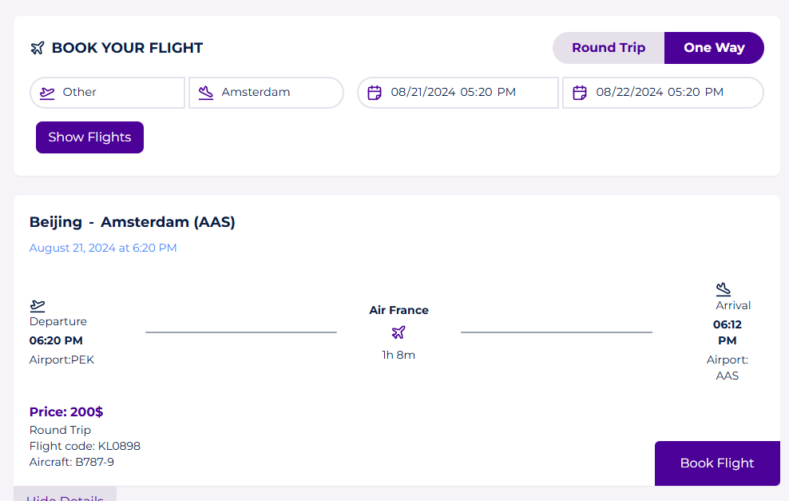
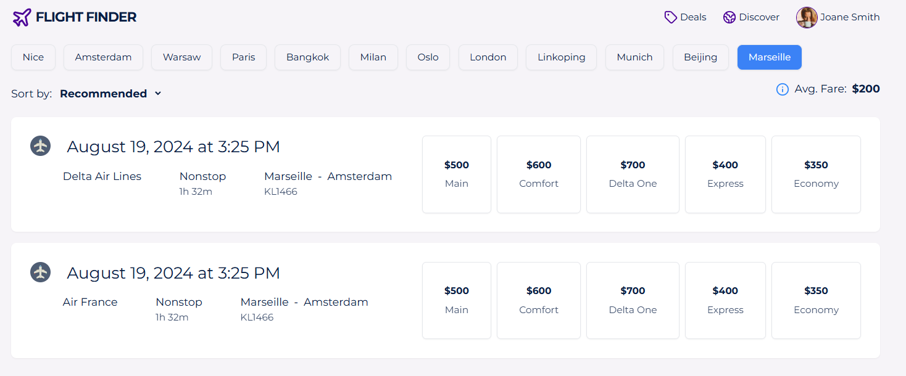

# Havalimanı Uçuş Bilgi ve Rezervasyon Sistemi

Bu proje, Schiphol Havalimanı API'sini kullanarak uçuş bilgilerini listeleyen ve kullanıcıların rezervasyon yapmasına olanak tanıyan bir web uygulamasıdır.

## Proje Yapısı

Proje iki ana bölümden oluşmaktadır:

- `frontend/`: React ile geliştirilmiş kullanıcı arayüzü
- `backend/`: Node.js ve Express ile geliştirilmiş API

Her bir bölüm kendi README dosyasına sahiptir ve orada daha detaylı bilgiler bulunmaktadır.

## Özellikler

- Uçuş bilgilerini listeleme
- Tarih ve hareket yönüne göre filtreleme
- Uçuş rezervasyonu yapma
- Kullanıcının rezervasyonlarını görüntüleme

## Başlangıç

Projeyi yerel makinenizde çalıştırmak için aşağıdaki adımları izleyin:

1. Repoyu klonlayın veya indirip açın:
2. Terminalde, dosya dizininde komutları girin:
```
cd backend
npm install
npm start
```
Bu işlem backendi çalışıtırcaktır.
3. ``cd .. ``  ile ana dizine dönüp Frontendi çalıştıralım:
```
cd frontend
npm install
npm run dev
```
4. Tarayıcınızda http://localhost:5173/ adresine gidin.

## Teknolojiler

- Frontend: React, Axios, Styled-components, TailwindCSS
- Backend: Node.js, Express, MongoDB, Axios
- API: Schiphol Havalimanı API

## Önemli Notlar

- Her iki projenin (frontend ve backend) test edilirken çalışır durumda olması gerekmektedir.
- Schiphol API'nin sağladığı veriler yer yer eksik olduğu için bazı alanlar (örneğin fiyat, iniş süreleri ve seyahat türü (gidiş-dönüş veya tek yön)) tahmini olarak doldurulmuştur.

### Son olarak
Frontend ve backend açıklamları için kendi dosyalarına gidin.

## İletişim

Sorularınız için: berkaysonel85@gmail.com

## Ekran Görüntüleri

### Genel


### Filtreleme


### Rezervasyon


### Başarısız Rezervasyon


### Uçuşlarım sayfası ve filtreleme
